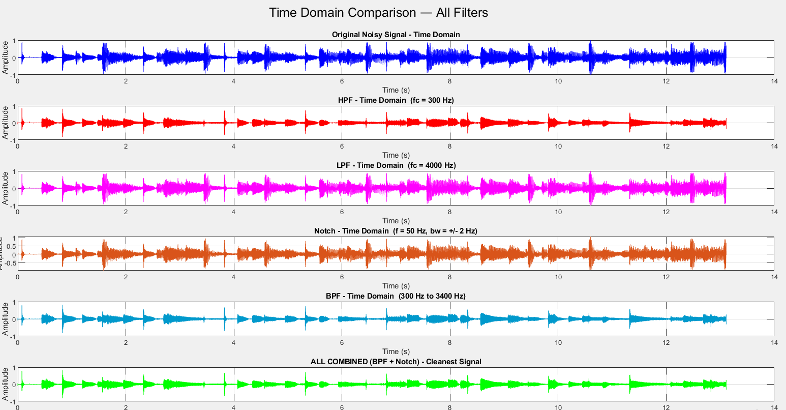

# Audio Signal Filtering — MATLAB

FFT-based digital signal filtering applied to a real audio file 
. Implements four filters in the frequency domain using FFT 
masking, with full time-domain and frequency-domain visualisation 
and audio playback comparison of each filtered output.

---

## Filters implemented

| Filter | Cutoff / Band | Purpose |
|---|---|---|
| High-Pass Filter (HPF) | 300 Hz | Removes low-frequency rumble |
| Low-Pass Filter (LPF) | 4000 Hz | Removes high-frequency noise |
| Notch Filter | 50 Hz ± 2 Hz | Eliminates 50 Hz powerline hum |
| Band-Pass Filter (BPF) | 300 Hz – 3400 Hz | Isolates human speech band |
| Combined (BPF + Notch) | Cleanest output signal |

---

## Output plots

### Time domain — all filters


---

## How it works

1. Reads a real audio file and converts to mono
2. Normalises the signal amplitude
3. Computes the FFT of the full signal
4. Applies binary frequency masks to zero out unwanted bands
5. Reconstructs filtered signals using inverse FFT (IFFT)
6. Plots time-domain and frequency-domain comparisons
7. Plays each filtered output sequentially for listening comparison

---

## How to run

1. Open `signal_filters.m` in MATLAB
2. Replace the audio file path (download Audio-Project.m4a as the default sound) on line 3 with your own file:
```matlab
[x_raw, Fs] = audioread('your_audio_file.m4a');
```
3. Run the script
4. Four figure windows will open showing all filter comparisons
5. Audio playback will begin automatically after plotting

---

## Concepts demonstrated

- FFT and IFFT for frequency domain signal processing
- Frequency domain filtering via binary spectral masking
- High-pass, low-pass, notch, and band-pass filter design
- Powerline hum removal (50 Hz notch)
- Speech band isolation (300–3400 Hz telephony standard)
- Time-domain and frequency-domain signal visualisation
- Real audio signal processing (mono conversion, normalisation)

---

## Tools

- MATLAB

---

## Author

Jawad Ahmed  
🔗 [LinkedIn](https://linkedin.com/in/jawad-ahmed-a80b33327)
